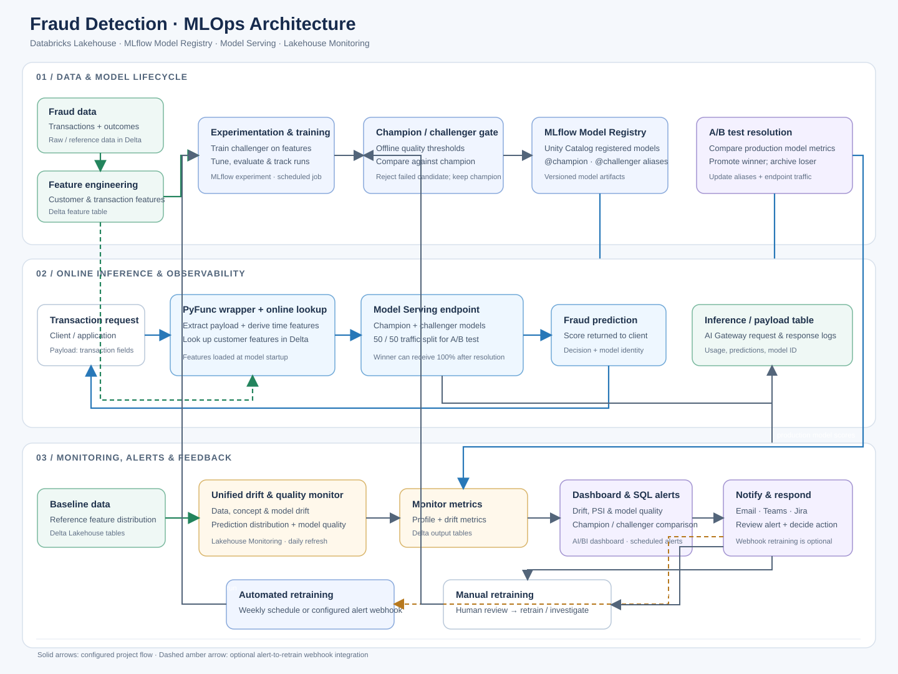

# fraud-model-mlops

End-to-end MLOps pipeline for online fraud detection on Databricks.

## Project Structure

```
fraud-model-mlops/
├── databricks.yml                # DABs config (dev + prod targets)
├── resources/
│   ├── fraud_model_job.yml       # Pipeline job: ingest->features->train->evaluate->deploy
│   ├── monitoring_job.yml        # Scheduled daily drift monitoring job
│   ├── alerts.yml                # SQL alerts for drift + prediction volume
│   └── registered_model.yml      # UC registered model + MLflow experiment
├──
├── src/                          # Source code
│   ├── __init__.py               # Package init
│   ├── config.py                 # Central config (catalog, schema, model, endpoint)
│   ├── data/
│   │   ├── ingestion.py          # [notebook] Raw data ingestion (batch + Auto Loader)
│   │   └── features.py           # [notebook] Feature engineering (Delta feature store)
│   ├── models/
│   │   ├── train.py              # [notebook] Model training with MLflow
│   │   └── evaluate.py           # [notebook] Champion/challenger evaluation
│   ├── serving/
│   │   ├── deploy.py             # [notebook] Model Serving endpoint deployment
│   │   └── ab_test.py            # [notebook] A/B traffic routing setup
│   └── monitoring/
│       ├── drift.py              # [notebook] PSI drift detection
│       └── alerts.sql            # SQL alert definitions for drift triggers
├── tests/
│   ├── unit/
│   │   ├── test_features.py      # Feature engineering unit tests
│   │   └── test_model.py         # Model training unit tests
│   └── integration/
│       └── test_pipeline.py      # End-to-end pipeline integration tests
├── notebooks/
│   ├── eda.py                    # [notebook] Exploratory data analysis
│   └── demo.py                   # [notebook] Full pipeline walkthrough
├── conf/
│   ├── cluster.json              # ML cluster configuration
│   └── serving.json              # Serving endpoint configuration
├── jobs/
│   └── pipeline.py               # [notebook] Orchestration entry point for Jobs
├── requirements.txt
├── .gitignore
└── README.md
```

Files marked `[notebook]` use `# Databricks notebook source` format — they render as
standard Python on GitHub but open as interactive notebooks in Databricks.

## Resources

| Resource | Purpose |
| --- | --- |
| ML Cluster | Training and feature engineering compute |
| Unity Catalog | `ml.fraud.*` tables (raw, features, predictions, drift) |
| Model Serving Endpoint | `fraud-classifier-endpoint` for real-time inference |
| Delta Feature Store | `ml.fraud.fraud_features` — offline feature table |
| DQ Monitor | Lakehouse Monitoring on predictions table (auto drift detection) |
| SQL Alerts | Fires on DQ Monitor drift metrics → triggers retrain via webhook |
| AI/BI Dashboard | Model A/B comparison (champion vs challenger) |

## Quick Start

### First-time (interactive)

1. **Configure** — Edit `src/config.py` defaults or set DABs target
2. **Ingest** — Run `src/data/ingestion.py` interactively to load raw data
3. **Features** — Run `src/data/features.py` to build the feature table
4. **EDA** — Use `notebooks/eda` to explore distributions and validate features
5. **Train** — Run `src/models/train.py` interactively, iterate on hyperparams
6. **Promote** — Run `src/models/evaluate.py` to tag your first champion
7. **Deploy** — Run `src/serving/deploy.py` to create the serving endpoint

### Ongoing (automated via DABs)

Once a champion model is registered, deploy the retraining pipeline:

1. `databricks bundle deploy -t prod`
2. The retrain job runs: ingest → features → retrain → evaluate vs champion → redeploy if promoted
3. DQ Monitor watches predictions table for drift; SQL alert triggers retrain job via webhook

## Testing

```bash
# Unit tests (no cluster needed)
pytest tests/unit/ -v

# Integration tests (requires Databricks cluster + UC access)
pytest tests/integration/ -v -m integration
```

## Architecture



The diagram shows the offline training and champion/challenger quality gate, online
feature enrichment and A/B serving, inference logging, unified drift and model-quality
monitoring, and the automated and manual retraining feedback paths. The serving
wrapper looks up customer features in Delta; it does not depend on a separate online
feature store. Alert-triggered retraining requires configuring the optional webhook;
the retraining job also runs on its weekly schedule.

## Deployment (DABs)

This project uses Declarative Automation Bundles for two-target deployment.
Same workspace host, different catalogs for full environment isolation.

| Setting | dev | prod |
| --- | --- | --- |
| Catalog | `ml_dev` | `ml` |
| Schema | `fraud_dev` | `fraud` |
| Model | `fraud_classifier_dev` | `fraud_classifier` |
| Endpoint | `fraud-classifier-dev` | `fraud-classifier` |
| Experiment | `fraud-model-experiment-dev` | `fraud-model-experiment-prod` |
| Job prefix | `[dev]` | `[prod]` |

### Commands

```bash
# Validate
databricks bundle validate -t dev
databricks bundle validate -t prod

# Deploy
databricks bundle deploy -t dev
databricks bundle deploy -t prod

# Run the retrain pipeline (after champion exists)
databricks bundle run fraud_model_retrain -t dev
databricks bundle run fraud_model_retrain -t prod

# Run drift monitoring
databricks bundle run fraud_drift_monitoring -t dev

# Destroy
databricks bundle destroy -t dev --auto-approve
```

### How Environment Flows Through

1. `databricks.yml` targets set `${var.catalog}`, `${var.schema}`, etc.
2. Resource YAMLs pass these as `base_parameters` to each notebook task.
3. `src/config.py` reads job parameters via `dbutils.widgets` at import time.
4. All downstream code uses `CFG.fq_*` properties, fully qualified to the right env.
5. Interactive runs default to `ml_dev.fraud_dev` (no parameters = dev).